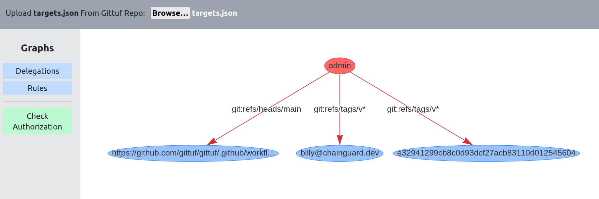
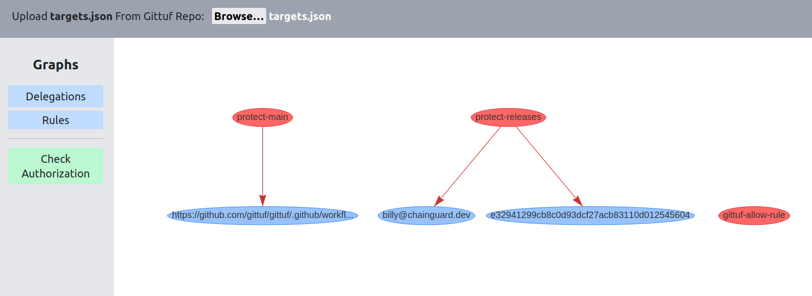
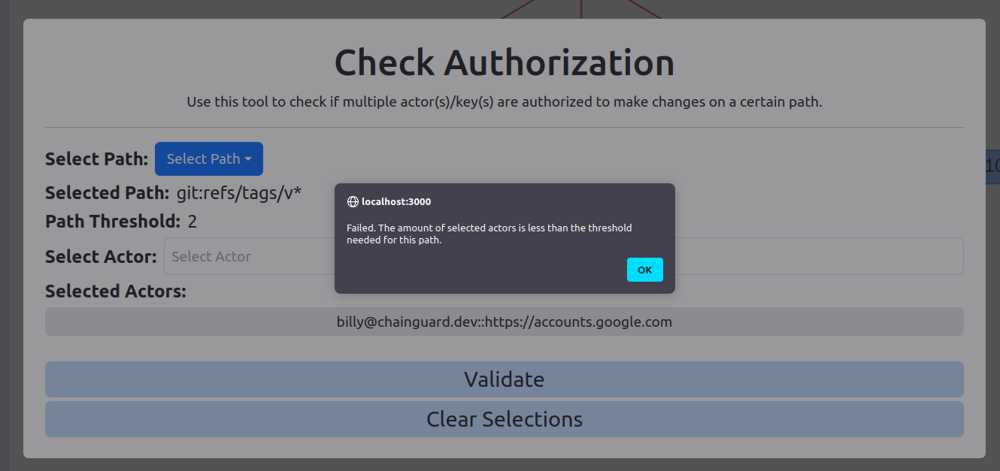

# Gittuf Targets Visualizer 

A tools used to visualize targets and delegations from gittuf metadata. Upload a [targets.json](https://theupdateframework.com/docs/metadata/#targets-metadata-targetsjson) file and graphs (using [Vis.js](https://visjs.github.io/vis-network/docs/network/)) will be generated to show delegations and targets. A tools is also included to see if actors are authorized to make changes to a repository. 

## Delegations Graph 

## Rules Graphs 

## Check Permissions
